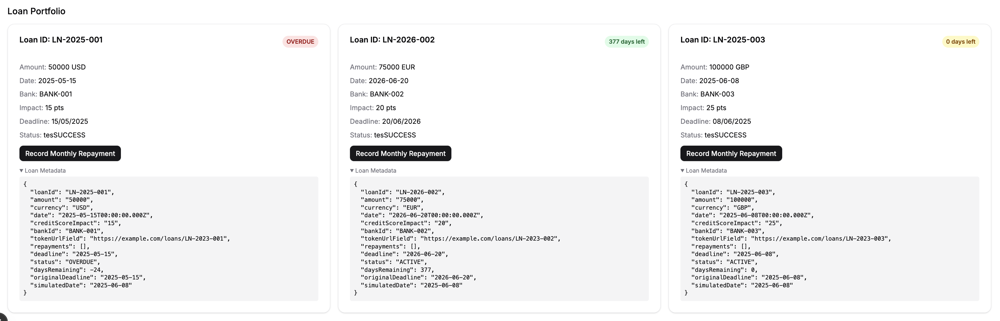

# U-PayMan
## Project description
To democratise financial reliability, by giving individuals full control, visibility, and verifiability over their credit performance across all bank accounts, loan providers, and payment platforms, using decentralised, tamper-proof blockchain technology.

## UI screenshots

## Demo video

## How it connects to XRP Ledger
when users make a loean repayment, an payment MPToken is minted and sent to the payment recipient in order to maintain consistent and immutable proof of payment on the blockchain.

## Block explorer links
[http://testnet.xrpl.org/ledgers/7898724](url)
